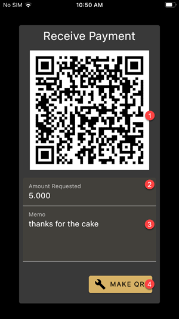

The Receive/Payment URI page is for making QR codes that encode

1. your receiving address (shielded or transparent)
2. an amount requested
3. and a memo text
4. Once you fill these fields, tap the "Make QR" button to update the QR code.

If you don't tap the button, the QR code is just your receiving address.

## Quick Actions

You can start a send/receive transaction directly from the app launcher / dashboard
by long pressing the app icon.

## Remarks

- When the app scans a QR code and detects a payment QR, it automatically
fills the amount and memo.
- When you scan a Payment URI with the iOS Camera app, it will offer to
open the app.
