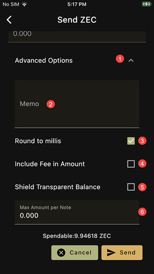

1. Show/Hide advanced options
2. Encrypted Memo
3. Enable/Disable rounding to 0.001 coin. If rounding is disabled,
the app uses zats: 1/100,000,000 of a coin
4. If checked, the amount includes the network fee 
of 0.01 mZEC or 0.01 mYEC, and the recipient receives slightly less 
than specified
5. If checked, the transaction also shields the transparent balance 
(if any)
6. The maximum amount per output note. If this is less than the amount
sent, the app will create several notes. The change is not subject to
this cap
