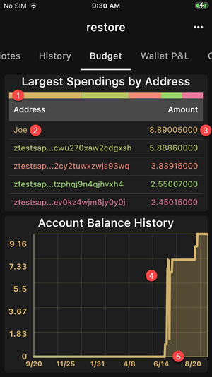

The budget page shows your largest spending / payments and
a chart of your past account balance. 

The table shows the top 5 addresses where you spent the most.

1. The length of each segment is proportional to its amount
2. Address or Contact Name. Tap to copy the address to the clipboard
3. Total Amount sent to the address
4. Tap and hold to show the exact balance at a given time
5. The time range can be adjusted in the Settings page
