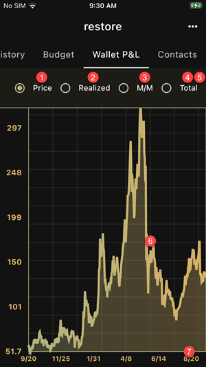

Wallet P/L (Profit and Loss) calculates and displays your wallet
performance versus fiat currency. It considers incoming funds
as purchases at market price and outgoing funds as sales.

For example, if you receive 1 ZEC when 1 ZEC=140 USD and then
spend 0.5 ZEC when 1 ZEC=150 USD, your wallet performance will be:

- 0.5 x (150 - 140) of realized profit
- 0.5 x (150 - 140) of unrealized profit

If later 1 ZEC=180 USD,

- your realized profit doesn't change since you didn't do any transaction
- your unrealized profit becomes 0.5 x (180-140) since the market price
increased

The app tracks the wallet in and out flows and evaluates profit and loss
based on [the average cost method](https://en.wikipedia.org/wiki/Average_cost_method).

1. Historical Price
2. Realized P/L 
3. Unrealized P/L (Marked to Market)
4. Total P/L (Realized + Unrealized)
5. Quantity and table (scroll right)
6. Tap/Hold to browse the chart
7. Adjust the time range in the Settings page

## Remarks

- The app uses the daily price data from CoinGecko. There is only
one price per day and therefore it will not take intraday movements
into consideration
- The historical price it uses could be different from your actual 
purchase or sale price. As a result, the P/L is only indicative
