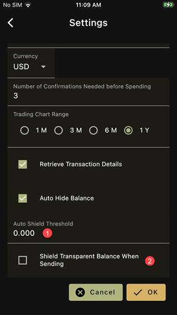

1. Auto shield your transparent balance when it is higher than this value. 
The app will create a separate transaction
2. Auto shield your transparent balance when you make a payment. The
payment will include a transfer from your transparent address to your
shielded address

## Remarks

- A value of 0 for option 1 means no automatic shielding
- With the option 2, the recipient of the payment can infer that the 
transparent address belongs to you
- You can also shield your balance manually at any time
